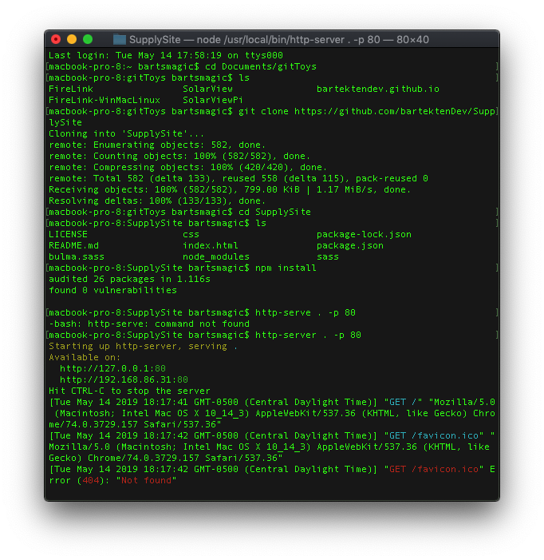
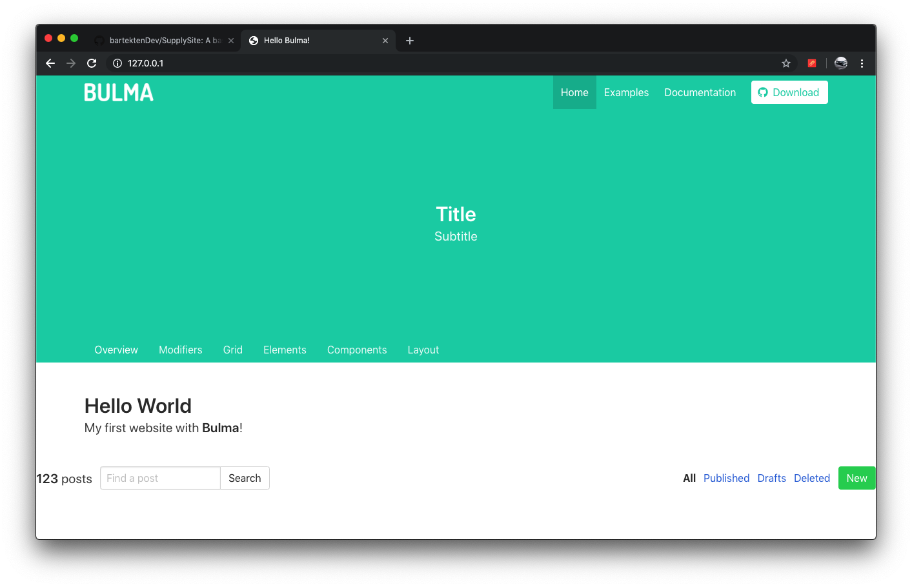

# SupplySite
A basic website of a web store. Use at your own discretion.

# Demo of How to Install + Screenshots
Step 1. Install SupplySite       |  Step 2. Launch the Webpage!
:-------------------------:|:-------------------------:
 | 

# How to Install:

Step 1. Open a directory in terminal where you git projects are or will be.
Then enter this into your terminal:

```
git clone https://github.com/bartektenDev/SupplySite
```

Step 2. Then open your terminal and cd (change drive location) to the
folder that was created (SupplySite). Then run these commands:
```
npm install
http-serve . -p 80
```

This will run a local server of the files in the SupplySite folder
and run the local server on port 80 for webpage viewing.

Step 3. Launch your browser and go to this link

```
http://127.0.0.1
```
It will launch the webstore webpage.

Enjoy! <3
-Bart
